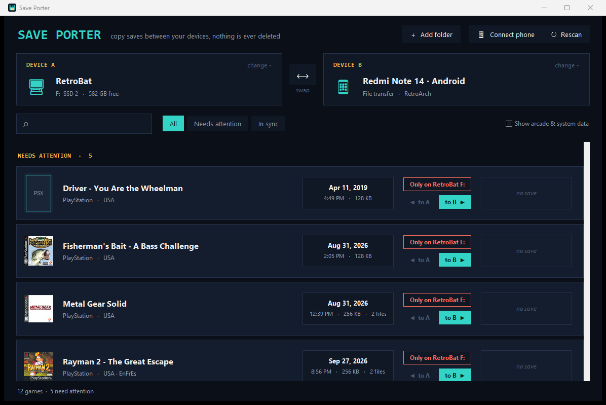

# Save Porter

Move emulator saves between your PC, your handheld and your phone. Plug stuff in, pick two devices, click an arrow.



I built this because I play the same games on a RetroBat PC, an R36S and my phone, and keeping the saves in sync by hand was a pain. Every emulator keeps saves somewhere different and some use different formats, so this does the digging for you.

## What it does

- Lists every game that has a save on either device, with box art from your RetroBat / ArkOS scrapes
- Shows which side is newer, or if a save only exists on one side
- One click copies a save across
- **Never deletes anything.** If a save is about to be replaced, the old one goes into a `_saveporter_backups` folder on that device first

## Supported

| Device | Notes |
|---|---|
| RetroBat (any drive) | found automatically in `X:\`, `X:\Emulation` or `X:\RetroBat`, or add a folder by hand |
| ArkOS handhelds (R36S etc.) | plug in the SD card, it looks for the `EASYROMS` partition |
| Android | RetroArch, Lemuroid, DuckStation, NetherSX2 / AetherSX2, Dolphin, PPSSPP |

Phones connect over plain USB file transfer (no setup), USB + ADB, or ADB over Wi-Fi. The app walks you through it.

PS1 memory cards convert between DuckStation (`.mcd`) and RetroArch (`.srm`) automatically. They're the same 128KB card image, just named and stored differently. GameCube `.gci`, PS2 memory cards and PSP saves map across too.

Some things can't move between some devices (a PS3 save has nowhere to go on an R36S). Those show up greyed out at the bottom.

## Download

Grab the zip from [Releases](../../releases), unzip, run `Save Porter.exe`. No install, it's portable.

Windows SmartScreen may warn you because the exe isn't code signed. Click **More info > Run anyway**.

## Running from source

Needs Python 3.11+ on Windows.

```
pip install -r requirements.txt
python gui.py
```

For phone support over ADB, put Google's [platform-tools](https://developer.android.com/tools/releases/platform-tools) in a `platform-tools` folder next to the scripts (or have `adb` on your PATH). USB file transfer works without it.

## Building the exe

```
build.bat
```

Needs PyInstaller (`pip install pyinstaller`) and the `platform-tools` folder above. Output lands in `dist\`.

## How it works (short version)

`saveporter.py` is the engine, `gui.py` is the window.

Every save file gets two paths: where it actually lives on its device, and where RetroBat *would* keep it. That second one is the common ground, it's how a DuckStation card on a phone and a RetroArch `.srm` on an R36S get recognised as the same game, and how the app knows where a copy should land.

A few things worth knowing if you poke around:

- RetroArch on Android puts every save in one folder, so the console is worked out by matching the save name against roms on your drives
- Newer Play Store builds of RetroArch save to `Android/media/...` and often sort saves by core, so the app reads RetroArch's own config on the phone instead of guessing
- MTP (USB file transfer) can't keep file dates, so `ledger.json` remembers the real ones for saves the app copied
- Xbox 360 saves only have title IDs, the real names come from the Xenia profile

## License

MIT, see [LICENSE](LICENSE). Bundled `adb` is from Android SDK Platform-Tools under the Apache License 2.0.
