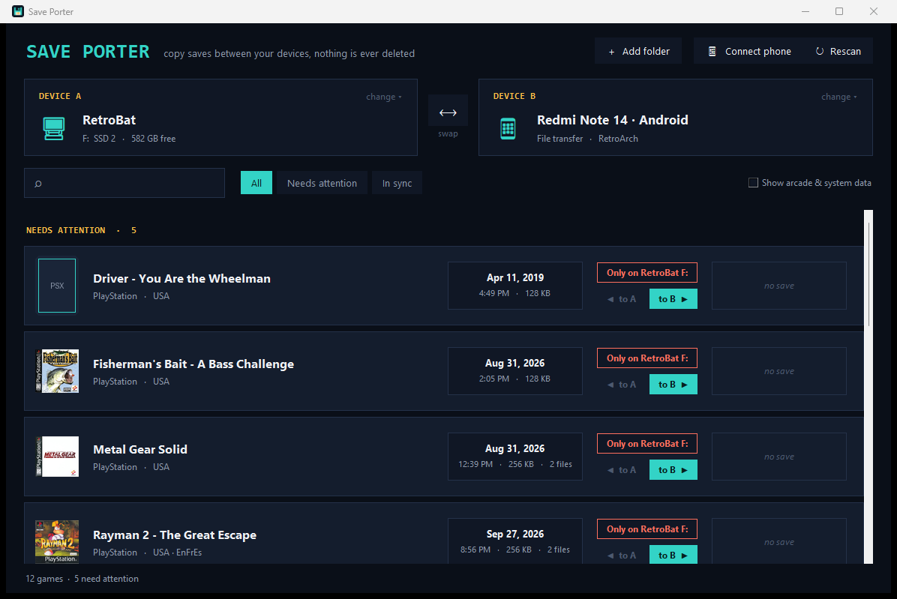

# Save Porter

Move emulator saves between your PC, your handheld and your phone. Plug stuff in, pick two devices, click an arrow.


## Download

**[Get the latest release](../../releases/latest)**, unzip it and run `Save Porter.exe`.

That's it. No install, no Python, nothing else to download. It's a single portable exe, so you can keep it on a USB stick with your emulation setup.

Windows SmartScreen may warn you the first time because the exe isn't code signed. Click **More info > Run anyway**.

## Why

I play the same games on a RetroBat PC, an R36S and my phone, and keeping the saves in sync by hand was a pain. Every emulator keeps saves somewhere different and some use different formats, so this does the digging for you.

## What it does

- Lists every game that has a save on either device, with box art from your RetroBat / ArkOS scrapes
- Shows which side is newer, or if a save only exists on one side
- One click copies a save across
- **Never deletes anything.** If a save is about to be replaced, the old one goes into a `_saveporter_backups` folder on that device first

## Supported

| Device | Notes |
|---|---|
| RetroBat (any drive) | found automatically in `X:\`, `X:\Emulation` or `X:\RetroBat`, or add a folder by hand |
| ArkOS handhelds (R36S etc.) | plug in the SD card, it looks for the `EASYROMS` partition |
| Android | RetroArch, Lemuroid, DuckStation, NetherSX2 / AetherSX2, Dolphin, PPSSPP |

PS1 memory cards convert between DuckStation (`.mcd`) and RetroArch (`.srm`) automatically. They're the same 128KB card image, just named and stored differently. GameCube `.gci`, PS2 memory cards and PSP saves map across too.

Some things can't move between some devices (a PS3 save has nowhere to go on an R36S). Those show up greyed out at the bottom.

## Connecting a phone



Hit **Connect phone** in the app for the full walkthrough. Three ways in:

- **USB file transfer**: plug in, unlock the phone, pick "File transfer" from the USB notification. No setup.
- **USB + ADB**: turn on USB debugging. Faster and more reliable.
- **Wi-Fi**: turn on Wireless debugging and type in the IP and port.

If the phone shows up but nothing loads, it's almost always one of these:

- the phone is locked (keep it unlocked while copying)
- USB went back to "Charging only" after replugging
- the connection got stuck, unplug it and plug it back in

For RetroArch to see a save, the game file needs the same name it has on your PC.

## Files it creates

- `devices.json` next to the exe, only if you add a folder by hand
- `ledger.json` next to the exe, remembers real save dates for phones that can't keep them
- `_saveporter_backups` on each device, old saves that got replaced. Delete old ones whenever

All safe to delete.

---

## For developers

You only need this if you want to run or build Save Porter from the source code. The download above already has everything bundled.

### Running from source

Needs Python 3.11+ on Windows.

```
pip install -r requirements.txt
python gui.py
```

For phone support over ADB, put Google's [platform-tools](https://developer.android.com/tools/releases/platform-tools) in a `platform-tools` folder next to the scripts (or have `adb` on your PATH). USB file transfer works without it.

### Building the exe

```
pip install pyinstaller
build.bat
```

Needs the `platform-tools` folder above, adb gets packed into the exe. Output lands in `dist\`.

### How it works

`saveporter.py` is the engine, `gui.py` is the window.

Every save file gets two paths: where it actually lives on its device, and where RetroBat *would* keep it. That second one is the common ground, it's how a DuckStation card on a phone and a RetroArch `.srm` on an R36S get recognised as the same game, and how the app knows where a copy should land.

A few things worth knowing if you poke around:

- RetroArch on Android puts every save in one folder, so the console is worked out by matching the save name against roms on your drives
- Newer Play Store builds of RetroArch save to `Android/media/...` and often sort saves by core, so the app reads RetroArch's own config on the phone instead of guessing
- USB file transfer (MTP) on some phones reports broken dates and can't set them, so `ledger.json` fills the gap
- Xbox 360 saves only have title IDs, the real names come from the Xenia profile

Issues and pull requests welcome.

## License

MIT, see [LICENSE](LICENSE). The bundled `adb` is from Android SDK Platform-Tools under the Apache License 2.0.
